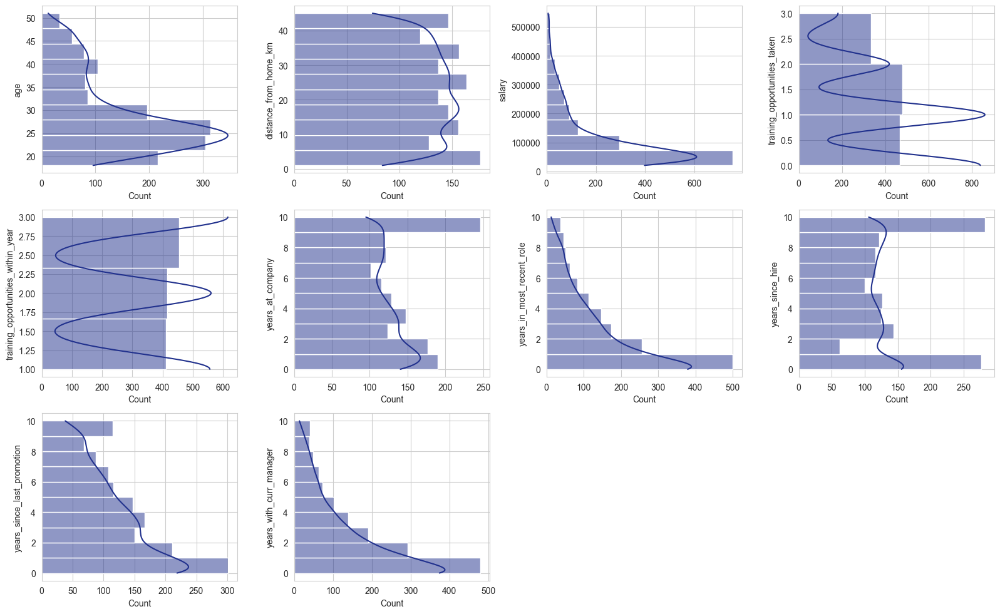
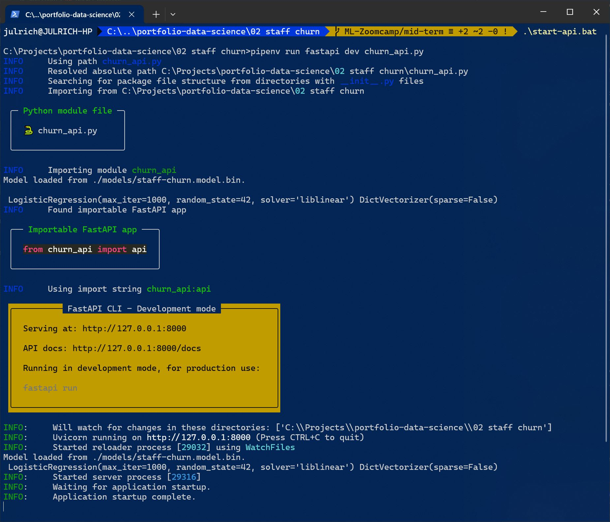
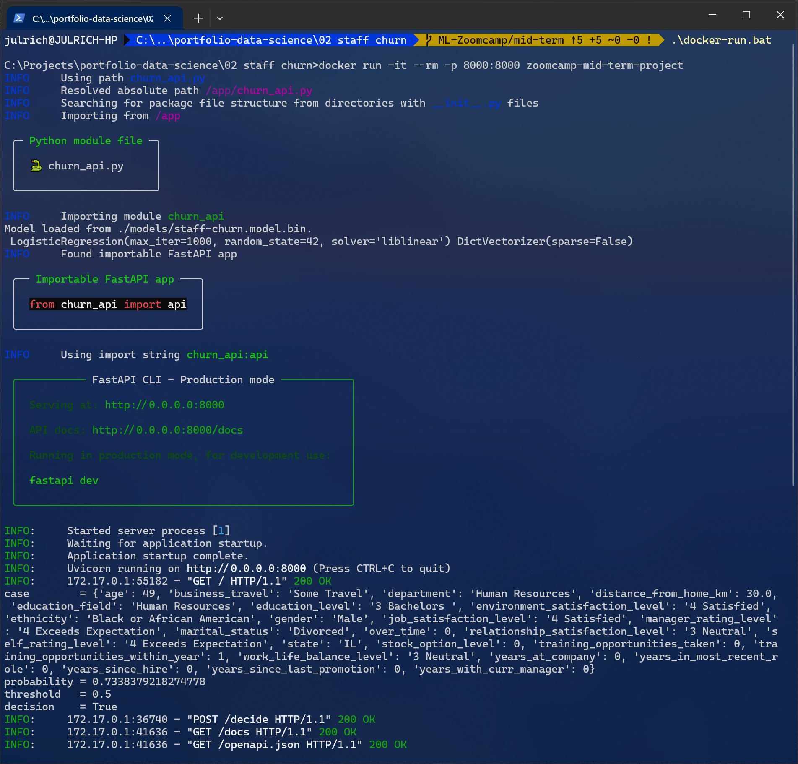
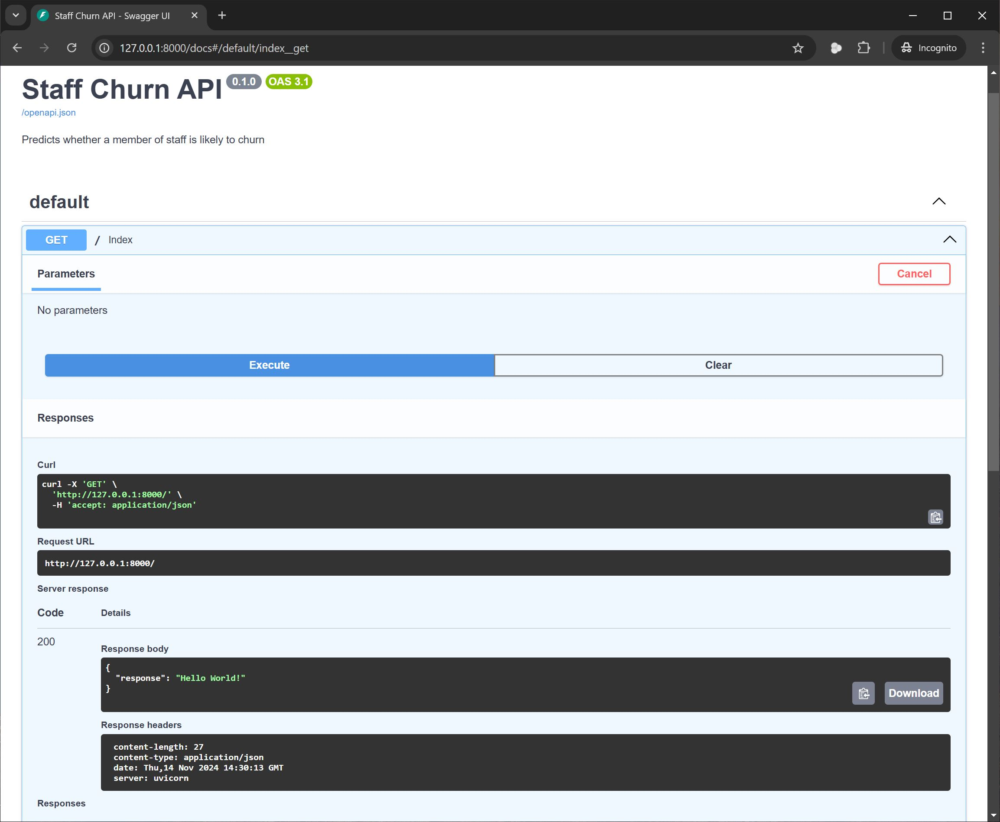
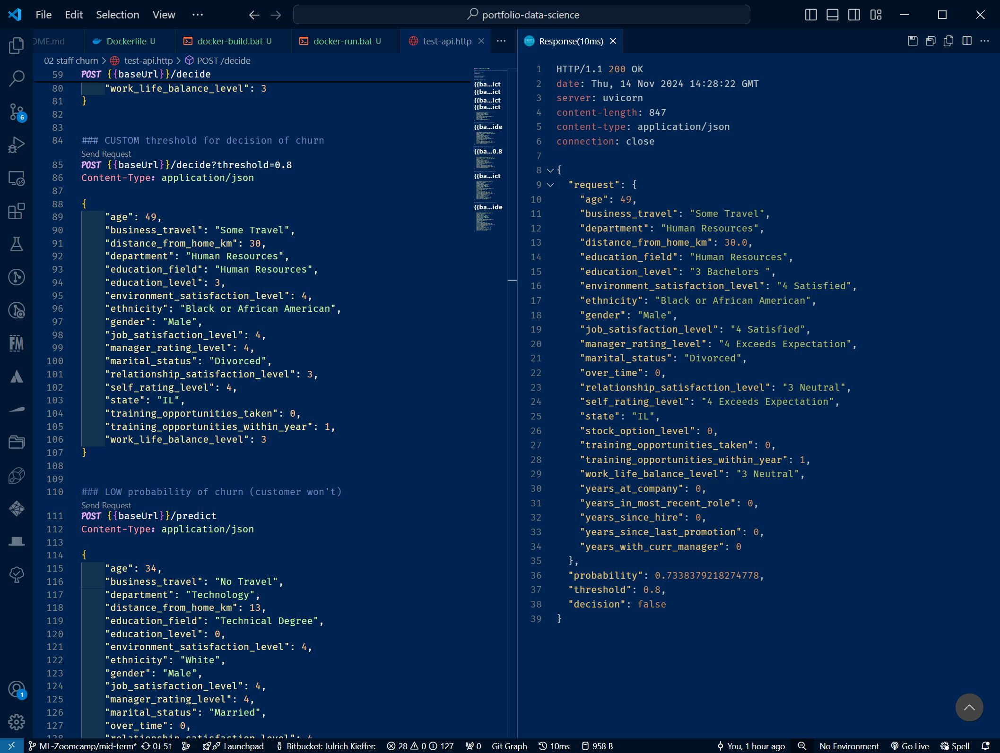

# Staff Churn Prediction
Machine Learning (ML) Zoomcamp Mid-term Project


## The problem domain

Ask yourself, were it possible:

1. Would you like forewarning of a staff member leaving?
1. Which traits / indicators are particularly conducive to forewarning of staff churn?
1. Could staff survey responses be analysed to calculate a probability of a staff member leaving, so their manager can proactively respond?
1. Could all staff survey responses be regularly analysed to allow HR to plan around predicted churn?

Using a [public dataset](https://www.kaggle.com/datasets/mahmoudemadabdallah/hr-analytics-employee-attrition-and-performance) of employee survey responses and HR data -- for a particular US company and their survey questions -- this project attempts to find whether this is indeed possible.

The value of such an innovation would be measured in both the attraction, retention, management intervention, and bottom line of such an organisation. However, doing so is not without trade-off.  This is rather the proof-of-concept, and it remains for others to address the operational, compliance and support impacts of such an approach.

After all, people are not data.  But data, here, could perhaps predict the behaviour of one's staff. And that alone, is the art-of-the-possible intended here.

## Objectives

- [x] Consider traits and insights that can be gleaned from the dataset to guide / understand the impacts on employees.
- [x] Targeting the `Attrition` feature, build a machine learning model to predict whether a given employee is likely to churn
- [x] Rank features that promote or reduce the likelihood of churn
- [x] "Operationalise" the machine learning model by wrapping it in an API, itself wrapped into a Docker container to create a microservice that can be used directly from any application that supports REST integration
- [x] Document findings, ML model design and selection, the API, and Docker container

## Data Analysis

A variety univariate and bivariate data analysis is demonstrated within the Jupyter Notebook [here](./notebook.ipynb), and illustrated, for example, with plots like:



**NOTE:** While many combinations of features would typically be contrasted to realise insights from the data, as marking criteria for this project draws focus to the target feature (`attrition`) only, this typical analysis is deferred as the effort would, in effect, realise no value. 

## Machine Learning

Using a variety of feature selection and model tuning parameters, the outcomes of the following machine learning model types was compared with a baseline accuracy of 77% (ROC AUC metric):

- Logistic Regression
- Random Forest
- Gradient Boosting

While tuned results achieved remarkably good, yet consistent, accuracy circa 97% across all 3 model types, as recall was best in the tuned Logistic Regression model, it was selected for API and "containerisation" under this proof of the art of the possible. See below.

All results from training, feature selection and model tuning is available [here](./notebook.ipynb#modelling).


## Local Development

Although VSCode and Python 3.11+ is recommended for local development, any IDE will suffice but is treated as out-of-scope / for the reader. 

However, to setup a local development environment:

1.  Download or clone the source code from [here](https://github.com/julrichkieffer/portfolio-data-science)
1.  Open a terminal / Powershell / command prompt, and navigate to the directory containing the source code
1.  Execute the following to download and install `pipenv`, a Python virtual environment:

    ```bash
    pip install pipenv
    ```

    <details>

    <summary>Notes on the above command</summary>

    If the above command fails, try the following in order:

    ```bash
    python3 -m pip install pipenv
    ```

    or on Linux / Mac only:

    ```bash
    sudo pip install pipenv
    ```

    or on Linux / Mac only:

    ```bash
    sudo python3 -m pip install pipenv
    ```

    </details>

1.  Execute the following command to create a Python virtual environment, and to download and install the necessary components:

    ```bash
    pipenv install --dev
    ```

    <details>

    <summary>Notes on the above command</summary>

    If the above command fails, try the following in order:

    ```bash
    python3 -m pipenv install --dev
    ```

    or on Linux / Mac only:

    ```bash
    sudo pipenv install --dev
    ```

    or on Linux / Mac only:

    ```bash
    sudo python3 -m pipenv install --dev
    ```

    </details>

1.  To run the API via the Python virtual environment, execute the following command:

    ```bash
    pipenv run fastapi dev churn_api.py
    ```

    <details>

    <summary>Notes on the above command</summary>

    If the above command fails, try the following in order:

    ```bash
    python3 -m pipenv run fastapi dev churn_api.py
    ```

    or on Linux / Mac only:

    ```bash
    sudo pipenv run fastapi dev churn_api.py
    ```

    or on Linux / Mac only:

    ```bash
    sudo python3 -m pipenv run fastapi dev churn_api.py
    ```

    </details>


If successful, you should see the terminal / Powershell / command prompt messages similar to:




## Docker Container (Production)

Docker is chosen as it's without doubt the most popular containerisation technology at the time of writing. However, there's no impediment to adopting another.  These instructions assume Docker Desktop or a similar installation of the Docker daemon.

### Building a Docker image

To build a Docker image of this solution -- API wrapped around the Machine Learning model:

1.  Download or clone the source code from [here](https://github.com/julrichkieffer/portfolio-data-science)
1.  Open a terminal / Powershell / command prompt, and navigate to the directory containing the source code
1.  Execute the following to build a local container image:

    ```bash
    docker build -t staff-churn-prediction .
    ```

    <details>

    <summary>Notes on the above command</summary>

    -  `docker build` is the base command for Docker to build an image
    -  `-t staff-churn-prediction` although tagging is recommended, the tag itself (`staff-churn-prediction` here) can be changed. If you do, ensure your run command (below) uses the same tag
    -  `.` is short-hand for the current directory. This assumes the source code is downloaded in the current directory, but can be replaced with a relative or absolute path to the source code instead

    </details>

**NOTE:** Building an image is typically only done once, or should a source code update demand a re-run of the the build command.

### Running the Docker image

Once a local image is built, it can be run several times without rebuilding the image again:

1.  Open a terminal / Powershell / command prompt

1.  Execute the following to run the local container image:

    ```bash
    docker run -it --rm -p 8000:8000 staff-churn-prediction
    ```

    <details>

    <summary>Notes on the above command</summary>

    -  `docker run` is the base command for Docker to run an image
    -  `staff-churn-prediction` although the tag itself (`staff-churn-prediction` here) can be changed (see above), this tells Docker which image to run
    -  `-p 8000:8000` as the API is a web endpoint it is available on a port, here `8000` in the running Docker container.  However, to make this endpoint available to other running applications (like a web browser), the API endpoint is mapped to a machine port, here `8000` too.  
    
        **NOTE:** Changing the machine port to the default port of `80` will mean all internet access is suspended while this Docker container is running.

        **NOTE:** As a local port is mapped to the API in the running container, only 1 instance can be running at the same time. If more than once instance of the API is sought, change the machine port per instance be varying the above run command. For example:

        ```bash
        docker run -it --rm -p 7999:8000 staff-churn-prediction
        ```

    - `-it --rm` tells Docker to start the image in interactive terminal (`-it`) mode, allowing keyboard commands to also pass through to the Docker container. And once stopped, `--rm` tells Docker to immediately remove the container. By default, Docker retains all instances of container runs.

        **NOTE:**  To stop the running container, from the terminal / Powershell / command prompt, send <kbd>Ctrl + C</kbd> (Linux, Windows) or <kbd>&#8984; + C</kbd> (Mac).

    </details>

If successful, you should see the terminal / Powershell / command prompt messages similar to:




## Application Programming Interface (API)

The Machine Learning model is wrapped by an application programming interface (API). Once a local Docker container is built and running, documentation of this API is available from the running Docker container [here](http://127.0.0.1:8000/docs).

You should see an internet brower window / tab similar to:



And, depending on availability of VSCode, appropriate extensions, and your familiarity with executing HTTP commands, the source code also contains examples of all API endpoint output variations in `./test-api.http`:

