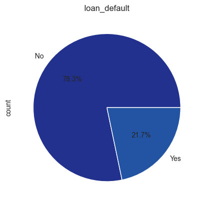
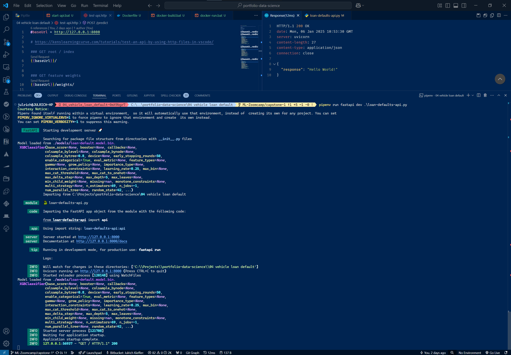
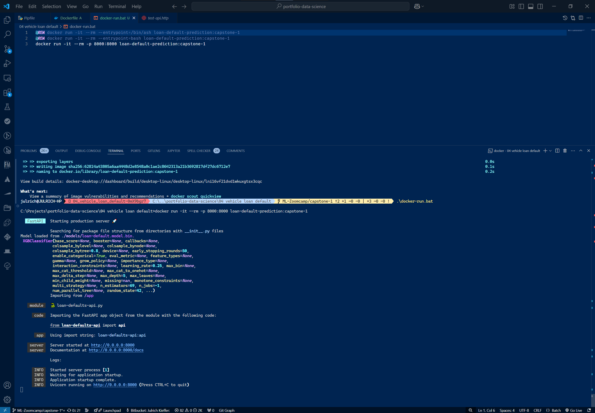
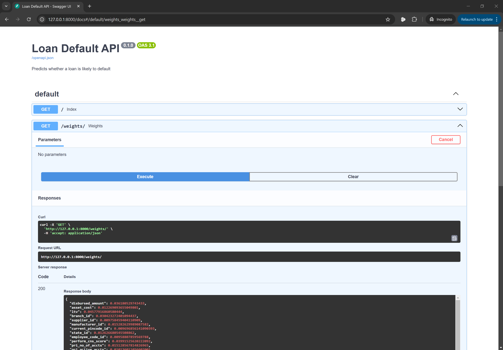
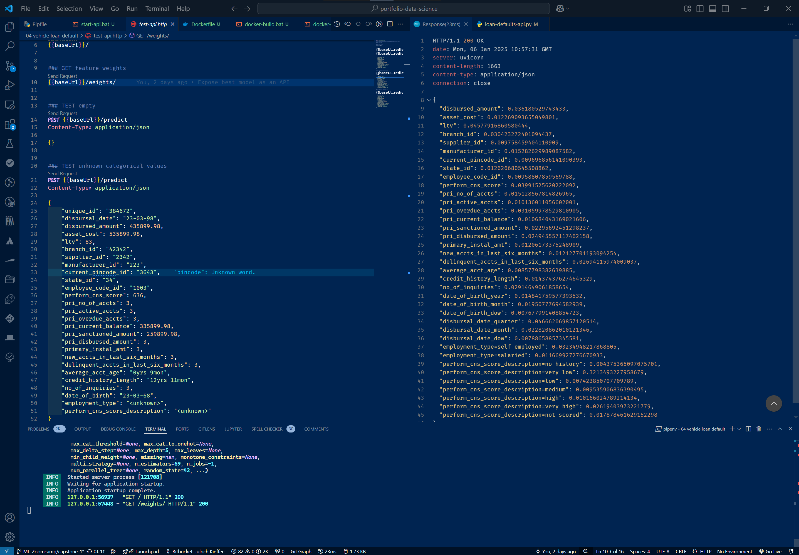
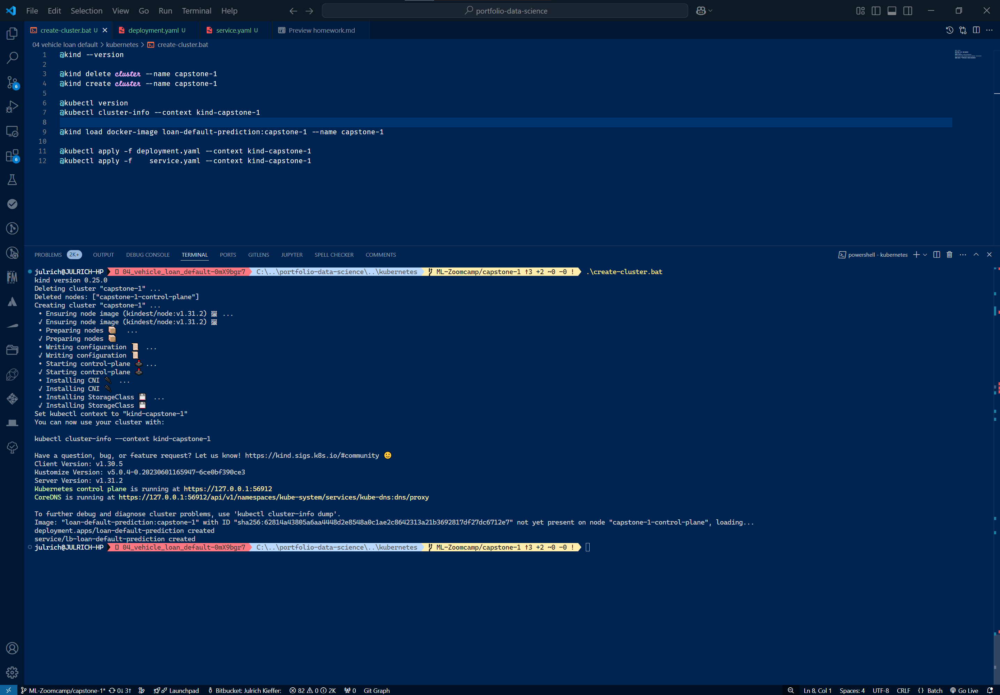
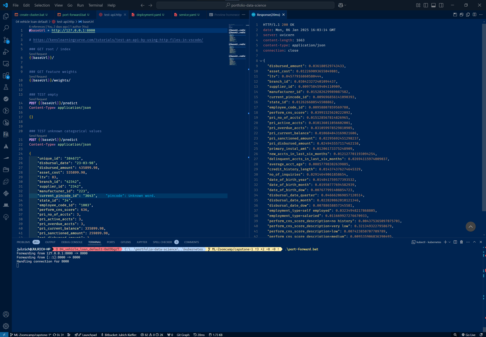

# Vehicle Loan Default
Machine Learning (ML) Zoomcamp Capstone #1 Project

## The problem domain

You're a commercial organisation that lends money.  However, you find that ~22% of loans granted run into difficulties, arising in defaults &mdash; repayments unilaterally suspended by the customer.  Would you not want to predict which customers / loans are likely to arise in defaults, and thus proactively reduce the incidence?

Using a [public dataset](https://www.openml.org/search?type=data&status=active&id=46430&sort=runs) of commercial loans data &mdash; for a particular US company and their lending protocols &mdash; this project attempts to find whether this is indeed possible.

The value of such an innovation would be measured in both the assessment of loans that are unlikely to arise in default (improving risk and confidence metrics), and in proactively avoiding loans that are likely to arise in default. This is rather a proof-of-concept, and it remains for others to address the operational, compliance and support impacts of such an approach.

After all, people are not data.  But data could perhaps predict the behaviour of one's customers. And that alone, is the art-of-the-possible intended here.

## Objectives

- [x] Consider traits and insights that can be gleaned from the dataset to guide / understand the impacts on loans.
- [x] Targeting the `loan_default` feature, build a machine learning model to predict whether a given customer / loan is likely to default
- [x] Rank features that promote or reduce the likelihood of default
- [x] "Operationalise" the machine learning model by wrapping it in an API, itself wrapped into a Docker container to create a microservice that can be used directly from any application that supports REST integration.  Further, provide scripts and configuration that demonstrates running such a container in Kubernetes, available in most cloud (IaaS) providers
- [x] Document findings, ML model design and selection, the API, and Docker container

## Data Analysis

A variety univariate and bivariate data analysis is demonstrated within the Jupyter Notebook [here](./notebook.ipynb), and illustrated, for example, with plots like:



**NOTE:** While many combinations of features would typically be contrasted to realise insights from the data, as marking criteria for this project draws focus to the target feature (`loan_default`) only, this typical analysis is deferred as the effort would, in effect, realise no value. 

## Machine Learning


Using a variety of feature selection and model tuning parameters, the outcomes of the following machine learning model types were compared with a baseline accuracy of 77% (ROC AUC metric):

- Decision Tree
- Random Forest
- Gradient Boosting


While tuned results achieved remarkably good, yet consistent, accuracy circa 97% across all 3 model types, as recall was best in the tuned Logistic Regression model, it was selected for API and "containerisation" under this proof of the art of the possible. See below.

All results from training, feature selection and model tuning is available [here](./notebook.ipynb#modelling).


## Local Development

Although VSCode and Python 3.11+ is recommended for local development, any IDE will suffice but is treated as out-of-scope / for the reader. 

However, to setup a local development environment:

1.  Download or clone the source code from [here](https://github.com/julrichkieffer/portfolio-data-science)
1.  Open a terminal / Powershell / command prompt, and navigate to the directory containing the source code
1.  Execute the following to download and install `pipenv`, a Python virtual environment:

    ```bash
    pip install pipenv
    ```

    <details>

    <summary>Notes on the command above</summary>

    If the above command fails, try the following in order:

    ```bash
    python3 -m pip install pipenv
    ```

    or on Linux / Mac only:

    ```bash
    sudo pip install pipenv
    ```

    or on Linux / Mac only:

    ```bash
    sudo python3 -m pip install pipenv
    ```

    </details>

1.  Execute the following command to create a Python virtual environment, and to download and install the necessary components:

    ```bash
    pipenv install --dev
    ```

    <details>

    <summary>Notes on the command above</summary>

    If the above command fails, try the following in order:

    ```bash
    python3 -m pipenv install --dev
    ```

    or on Linux / Mac only:

    ```bash
    sudo pipenv install --dev
    ```

    or on Linux / Mac only:

    ```bash
    sudo python3 -m pipenv install --dev
    ```

    </details>

1.  To generate a tuned model via the Python virtual environment, execute the following command:

    ```bash
    pipenv run train_and_persist.py
    ```

    <details>

    <summary>Notes on the command above</summary>

    If the above command fails, try the following in order:

    ```bash
    python3 -m pipenv run train_and_persist.py
    ```

    or on Linux / Mac only:

    ```bash
    sudo pipenv run train_and_persist.py
    ```

    or on Linux / Mac only:

    ```bash
    sudo python3 -m pipenv run train_and_persist.py
    ```

    </details>

1.  To run the API via the Python virtual environment, execute the following command:

    ```bash
    pipenv run fastapi dev loan-defaults-api.py
    ```

    <details>

    <summary>Notes on the command above</summary>

    If the above command fails, try the following in order:

    ```bash
    python3 -m pipenv run fastapi dev loan-defaults-api.py
    ```

    or on Linux / Mac only:

    ```bash
    sudo pipenv run fastapi dev loan-defaults-api.py
    ```

    or on Linux / Mac only:

    ```bash
    sudo python3 -m pipenv run fastapi dev loan-defaults-api.py
    ```

    </details>


If successful, you should see the terminal / Powershell / command prompt messages similar to:




## Docker Container (Production)

Docker is chosen as it's without doubt the most popular containerisation technology at the time of writing. However, there's no impediment to adopting another.  These instructions assume Docker Desktop or a similar installation of the Docker daemon.

### Building a Docker image

To build a Docker image of this solution &mdash; API wrapped around the Machine Learning model:

1.  Download or clone the source code from [here](https://github.com/julrichkieffer/portfolio-data-science)
1.  Open a terminal / Powershell / command prompt, and navigate to the directory containing the source code
1.  Execute the following to build a local container image:

    ```bash
    docker build -t loan-default-prediction:capstone-1 .
    ```

    <details>

    <summary>Notes on the command above</summary>

    -  `docker build` is the base command for Docker to build an image
    -  `-t loan-default-prediction:capstone-1` although tagging is typically recommended, it is required for Kubernetes deployment (see below). Moreover, the tag itself (`loan-default-prediction:capstone-1` here) is expected by Kubernetes scripts below, can be changed if done in all references to the tag. If you do, ensure your run command (below) uses the same tag too
    -  `.` is short-hand for the current directory. This assumes the source code is downloaded in the current directory, but can be replaced with a relative or absolute path to the source code instead

    </details>

**NOTE:** Building an image is typically only done once, or should a source code update demand a re-run of the the build command.

### Running the Docker image

Once a local image is built, it can be run several times without rebuilding the image again:

1.  Open a terminal / Powershell / command prompt

1.  Execute the following to run the image in a local container:

    ```bash
    docker run -it --rm -p 8000:8000 loan-default-prediction:capstone-1
    ```

    <details>

    <summary>Notes on the command above</summary>

    -  `docker run` is the base command for Docker to run an image
    -  `loan-default-prediction:capstone-1` although the tag itself can be changed (see notes above), this tells Docker which image to run
    -  `-p 8000:8000` as the API is a web endpoint it is available on a port, here `8000` in the running Docker container.  However, to make this endpoint available to other running applications (like a web browser), the API endpoint is mapped to a machine port, here `8000` too.  
    
        **NOTE:** Changing the machine port to the default port of `80` will mean all internet access is suspended while this Docker container is running.  Your computer my thus reject this command to prevent this impact.

        **NOTE:** As a local port is mapped to the API in the running container, only 1 instance can be running at the same time. If more than once instance of the API is sought, change the machine port per instance be varying the above run command. For example:

        ```bash
        docker run -it --rm -p 7999:8000 loan-default-prediction:capstone-1
        ```

    - `-it --rm` tells Docker to start the image in interactive terminal (`-it`) mode, allowing keyboard commands to also pass through to the Docker container. And once stopped, `--rm` tells Docker to immediately remove the container. By default, Docker retains all instances of container runs.

        **NOTE:**  To stop the running container, from the terminal / Powershell / command prompt, send <kbd>Ctrl + C</kbd> (Linux, Windows) or <kbd>&#8984; + C</kbd> (Mac).

    </details>

If successful, you should see the terminal / Powershell / command prompt messages similar to:




## Application Programming Interface (API)

The Machine Learning model is wrapped by an application programming interface (API). Once a local Docker container is built and running, documentation of this API is available from the running Docker container [here](http://127.0.0.1:8000/docs).

You should see an internet brower window / tab similar to:



And, depending on availability of VSCode, appropriate extensions, and your familiarity with executing HTTP commands, the source code also contains examples of all API endpoint output variations in `./test-api.http`:



## Kubernetes Deployment (Production)

While cloud (IaaS) providers offer various approaches to running "containerised" services on-demand, the most popular of these &mdash; also most widely supported across providers &mdash; is Kubernetes.

That said, as documented above, wherever a container can be run, this solution can be deployed according to available skills, preferences, and operational factors prevailing for the organisation at the time.  Therefore, documenting this locally-hosted Kubernetes approach is not to imply any constraint whatsoever, but rather to demonstrate enterprise-grade production deployment is eminently achievable, when needed.

The following are assumed by the following instructions:

1. A Kubernetes cluster is available with sufficient administrative privileges to deploy new containers into it. Or, using [kind](https://kind.sigs.k8s.io/docs/user/quick-start/), a local kuberneters cluster is available. This is the approach illustrated below

1. [kubectl](https://kubernetes.io/releases/download/), the command-line interface (CLI) to the Kubernetes cluster is available. As the author has Docker Desktop (Windows) installed, this is already installed

1. kind, if applicable, and kubectl are available via the system `PATH` environment variable

1. Sufficient administrative privileges are held to create, delete, deploy into, and amend Kubernetes clusters (without `sudo`, for example)

1. Using the above instructions, a Docker image tagged with `loan-default-prediction:capstone-1` is already built

1. A non-default kubernetes cluster named `[kind-]capstone-1` will be used to separate this project from any other kubernetes cluster


### Creating a (local) Kubernetes deployment

To ensure kind, if a local Kubernetes cluster is to be used, and kubectl are correctly installed, do not proceed unless the below commands run without error:

```bash
kind --version  # only if local Kubernetes is to be used
kubectl version
```

Then, ensure the current source folder is `./kubernetes/`, perhaps by executing:

```bash
cd ./kubernetes
```

For Windows users, [a convenience script](./kubernetes/create-cluster.bat) is included.  However, all platforms can execute the following commands to setup a Kubernetes deployment using the already-built Docker image:

0. To delete any existing Kubernetes cluster of the same name, optionally execute

    ```bash
    kind delete cluster --name capstone-1
    ```

1. To create a local Kubernetes cluster, and to confirm success, execute the following 2 commands

    ```bash
    # Use kubectl equivalent if not a local cluster
    kind create cluster --name capstone-1

    # Drop kind- from context identifier if not a local cluster
    kubectl cluster-info --context kind-capstone-1
    ```

1.  To register the already-built Docker image with Kubernetes

    ```bash
    kind load docker-image loan-default-prediction:capstone-1 --name capstone-1
    ```

1.  To deploy the registered image into a Kubernetes pod

    ```bash
    kubectl apply -f deployment.yaml --context kind-capstone-1
    ```

1.  To expose the registered image via a load balancer service

    ```bash
    kubectl apply -f service.yaml --context kind-capstone-1
    ```



After a few seconds to allow the preceding two commands to apply, the containerised model and API will be deployed to (local) Kubernetes! 🏆

### Port-forward to the Kubernetes cluster

By default, a Kubernetes cluster is an operational silo / ring-fenced. Therefore, to call any service in the cluster, a port must exposed to the caller.

For Windows users, [a convenience script](./kubernetes/port-forward.bat) is included. However, all platforms can execute the following commands to establish an ephemeral (temporary, until the command is cancelled) connection into the deployed Kubernetes pod:

```bash
kubectl port-forward service/lb-loan-default-prediction 8000:80 --context kind-capstone-1
```

This maps the local port 8000 to the default web (HTTP traffic) port 80 of the cluster's load balancer, as illustrated:



## Incremental learning / skills demonstrated in this showcase project

- [x] Rich output in scrips and notebooks
- [x] Chained Dataframe cleaning, EDA, plots, etc
- [x] Algorithmic feature selection
- [x] Train vs validation data ROC plots, showing tuning outcomes per model type
- [x] Kind (Kubernetes local) deployment

<!-- 
#IDEA Capstone #2
- [ ] Scikit pipeline
- [ ] automated hyperparameter tuning: hyperopt
- [ ] actual vs predicted plots
- [ ] If applicable: impute, standardise, log1p
- [ ] PyArrow & Numpy 2
- [ ] Deep Learning on Logistic Regression problem
- [ ] Plotly, learning rate curve plots (see Matt Harrison Pandas & databases)
- [ ] Shiny UI: report and "live" model prediction
- [ ] BPMN / application integration
- [ ] https://www.openml.org/search?type=data&status=active&id=46504
- [ ] https://www.openml.org/search?type=data&status=active&id=46361

#IDEA Future showcase project
- [ ] UV package manager
- [ ] text (and stop words) -> features
- [ ] time series data handling and EDA
- [ ] time series forecasting, using lagging and exogenous features (eg house price prediction, seasonal sales forecasting)
- [ ] Polars
- [ ] London Property.zip

#HACK

```powershell
$env:FOO='BAR'; .\myscript; $env:FOO=$null
```

business overview / existing contracts insights

partnercommunity.conga.com  (use Samurai credentials, 1st login -> change password)
 - CCI  Conga Contract Intelligence, 
 - CLM,  

Quick-start projects (templates for workshops, Jira, Confluence)
-->